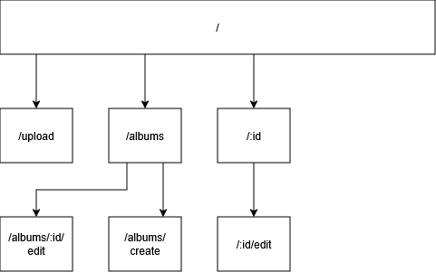

# JBOF

## Ziel

### V1

In der V1 sollen folgende Features implementiert werden

- Upload für Fotos und Videos
- Einordnen in Album
- Upload Single oder Batch
- Benennung der Files / Alben
- Source Attribut für Uplaod
- Im Frontend Soll es eine Liste geben mit allen Bildern und Videos

#### Frontend

##### gallery Page (All Images)

/

(to see album pics, it filters)

##### Upload Page

/upload

##### Gallery (Page Albums)

/albums

##### Album Create Page

/albums/create

##### Album Create Page

/albums/:id/create

##### Detail View Page

/:id

##### Edit Page

/:id/edit

#### Frontend User Flow

### Zukunftsausblick

- Personenerkennung (auch nach Implementiert für bestand)
- Teilen von Bildern untereinander
- Fotos teilen via QR code
- Objekterkennung
- Personen erkennung
- Tags
- Description
- Login
- Registr/ create Person
- Admin Interface
- user Settings
- Statistics
- Filter

## DB Struktur Temp
